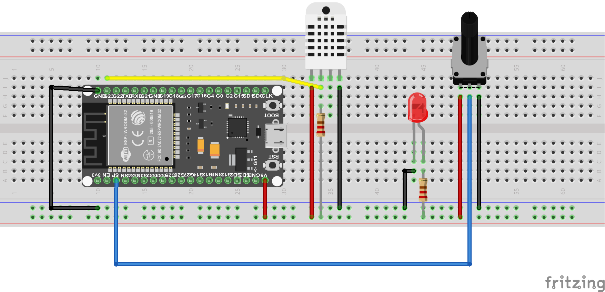
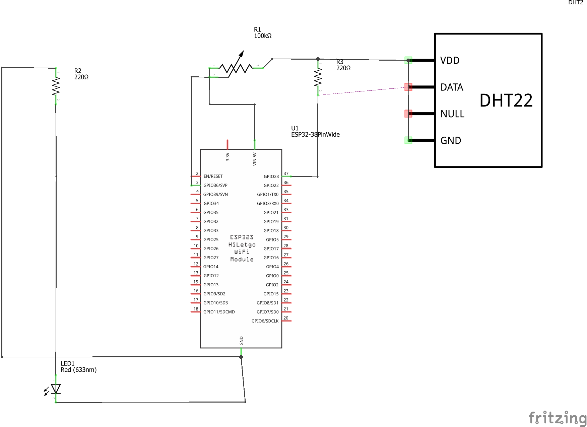

## une brève description de la configuration :
- tout d'abord, nous avons d'abord utilisé un potentiomètre pour lire et afficher l'entrée analogique
- Deuxièmement ; nous avons ajouté un capteur de température et d'humidité DHT22.

### branchements des pins :
- Pour l'entrée, utilisons un potentiomètre de 10K ohms, en le connectant de 5V et GND. Utilisons sa sortie variable comme entrée pour les broches ESP32 ADC. Le schéma ci-dessous montre le potentiomètre connecté au GPIO 36 qui est le canal 0 de l'ADC1.
- Pour le DHT22 :
   * Pin VCC ==> 5V
   * Pin Data ==> GPIO 23
   * N/C
   * PIN GND ==> GND

## images :
### sketch :
 

### schematic design :


## code :
### potentiomètre
```c++
#define ANALOG_PIN_0 36
int analog_value = 0;

// PMW LED
#define LED_PIN 2
int freq = 5000;
int ledChannel = 0;
int resolution = 8;
int dutyCycle = 0;

void setup()
{
  Serial.begin(115200);
  Serial.println("ESP32 Analog IN/OUT Test");

  ledcSetup(ledChannel, freq, resolution);
  ledcAttachPin(LED_PIN, ledChannel);
  ledcWrite(ledChannel, dutyCycle);
}

void loop()
{
  analog_value = analogRead(ANALOG_PIN_0);
  Serial.println(analog_value);
  dutyCycle = map(analog_value, 0, 4095, 0, 255);
  ledcWrite(ledChannel, dutyCycle);
  delay(500);
}
```
### DHT22
la bibliothèque Adafrut doit être installée; cela rend l'utilisation du capteur beaucoup plus facile.
```c++
/* DHT */
#include "DHT.h"
#define DHTPIN 23  
#define DHTTYPE DHT22 
DHT dht(DHTPIN, DHTTYPE);
float localHum = 0;
float localTemp = 0;

void setup()
{
  Serial.begin(115200);
  delay(1000); // give me time to bring up serial monitor
  Serial.println("");
  Serial.println("ESP32 DHT Temperature and Humidity ");
  Serial.println("");
  dht.begin();
}

void loop()
{
  getDHT();
  Serial.print("Temp: ==> ");
  Serial.print(localTemp);
  Serial.print("  Hum ==> ");
  Serial.println(localHum);
  delay(2000);
}
void getDHT()
{
  float tempIni = localTemp;
  float humIni = localHum;
  localTemp = dht.readTemperature();
  localHum = dht.readHumidity();
  if (isnan(localHum) || isnan(localTemp))   
  {
    localTemp = tempIni;
    localHum = humIni;
    return;
  }
}
```


